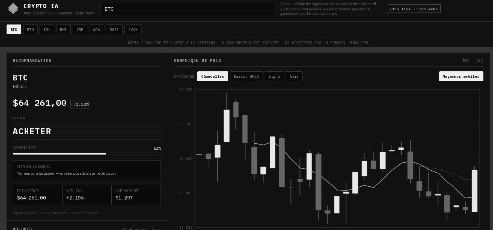

<div align="center">
  
  <h1>Crypto IA — Dashboard d'analyse</h1>
  <p>Outil d'aide à la décision en trading crypto, en HTML/CSS/JS pur.</p>
</div>

---

> **Avertissement**
> Cet outil affiche des données de marché et des signaux calculés localement, à titre **informatif uniquement**.
> Il n'exécute **aucun ordre** d'achat ou de vente et n'est connecté à aucun exchange.
> Il ne constitue pas un conseil financier, ne garantit aucun résultat, et les performances passées ne préjugent pas des performances futures.

## Aperçu



Un tableau de bord noir et blanc façon terminal de trading, dense et anguleux, qui regroupe :

- **Recommandation** — signal Acheter / Vendre / Attendre calibrable selon l'horizon de trading, niveau de confiance, suggestion de timing, prix, variation 24h et capitalisation
- **Graphique de prix** — 30 jours, avec quatre modes d'affichage au choix (chandelles, barres OHLC, ligne, aire) et moyennes mobiles MA7 / MA25 activables
- **Volumes** — volume 24h, moyenne, écart vs moyenne et historique sur 14 jours
- **News & annonces** — actualités réelles agrégées depuis quatre flux RSS crypto et filtrées sur la crypto affichée, chacune portant un « niveau de sérénité » (calme, neutre, tendu, alarmant) rendu en nuances de gris et motifs
- **Hold long terme** — cryptos à faible volatilité, avec capitalisation et tendance
- **Court terme / volatilité** — cryptos à forte volatilité récente, avec momentum
- **Alertes de signaux** — notification verte à l'achat, rouge à la vente, dès qu'une crypto de la watchlist bascule ; chacune se ferme d'une croix et un bouton coupe l'ensemble
- **Assistant** — bouton en bas à droite, fenêtre de conversation collée au dashboard : questions sur le timing, le volume ou les news de la crypto affichée

La recherche accepte n'importe quelle crypto référencée par CoinGecko, pas seulement celles de la watchlist.

## Prérequis

- Python 3 — sert le dashboard et agrège les flux RSS des news
- Une clé API CoinGecko Demo (gratuite)

Aucune dépendance à installer : pas de build, pas de `npm install`, bibliothèque standard uniquement.

## Obtenir une clé API CoinGecko

La clé du plan **Demo** est gratuite et suffit largement pour ce dashboard (30 appels/minute, 10 000 appels/mois).

1. Créez un compte sur [coingecko.com](https://www.coingecko.com/account/sign_up)
2. Une fois connecté, ouvrez [Developer Dashboard](https://www.coingecko.com/en/developers/dashboard)
3. Cliquez sur **Add New Key** (ou **Create a Demo API Key**)
4. Copiez la clé générée — elle commence par `CG-`

Cette clé ne donne accès qu'à des données publiques de marché : elle ne permet aucune opération sur votre compte.

## Installation

```bash
git clone https://github.com/THEgrison/crypto-ia-dashboard.git
cd crypto-ia-dashboard
```

Ouvrez `js/config.js` et remplacez le placeholder par votre clé :

```javascript
window.COINGECKO_CONFIG = {
  apiKey: 'CG-VOTRE-CLE-ICI',
  baseUrl: 'https://api.coingecko.com/api/v3',
  refreshIntervalMs: 60_000,
};
```

Sans clé, le dashboard démarre quand même et bascule sur les données de démonstration incluses.

> **Important — évitez de publier votre clé**
> `js/config.js` est versionné dans ce dépôt (il contient un placeholder). Si vous y collez votre clé et poussez vos modifications, **elle deviendra publique**.
>
> Après avoir ajouté votre clé, demandez à git d'ignorer vos modifications de ce fichier :
>
> ```bash
> git update-index --skip-worktree js/config.js
> ```
>
> Pour annuler plus tard : `git update-index --no-skip-worktree js/config.js`

## Lancer le projet

```bash
python3 server.py
```

Puis ouvrez http://localhost:8080. Le port se change en argument : `python3 server.py 3000`.

`server.py` n'utilise que la bibliothèque standard, sans dépendance à installer. Il sert les fichiers du dashboard **et** expose `/api/news`, qui agrège les flux RSS côté serveur.

Un serveur local est **indispensable** : ouvrir `index.html` directement en `file://` fait échouer les appels à l'API (politique CORS du navigateur). N'importe quel serveur statique fonctionne également, mais la section News retombe alors sur les données de démonstration :

```bash
python3 -m http.server 8080   # sans les news réelles
npx serve .                   # Node
php -S localhost:8080         # PHP
```

L'indicateur en haut à droite affiche l'état de la connexion : `Prix live · CoinGecko` quand les données sont réelles, un message d'erreur avec repli sur les données locales sinon. Le badge du panneau News signale de la même façon `Flux RSS · live` ou `Démo · proxy news inactif`.

## Structure

```
crypto-ia-dashboard/
├── index.html            # Structure du dashboard
├── server.py             # Serveur statique + agrégation RSS (/api/news) + assistant (/api/chat)
├── .env.example          # Modèle de la clé Groq (facultative)
├── assets/logo.png       # Logo et favicon
├── css/styles.css        # Thème sombre anguleux
└── js/
    ├── config.js         # Clé API et paramètres de rafraîchissement
    ├── data.js           # Données de démonstration et utilitaires
    ├── api.js            # Client CoinGecko
    ├── news.js           # Client du proxy news
    ├── notifications.js  # Alertes de signaux achat/vente
    ├── chat.js           # Widget de conversation
    ├── charts.js         # Rendu Canvas des graphiques
    └── app.js            # Logique d'interface
├── assets/logo.png       # Logo et favicon
├── css/styles.css        # Thème sombre anguleux
└── js/
    ├── config.js         # Clé API et paramètres de rafraîchissement
    ├── data.js           # Données de démonstration et utilitaires
    ├── api.js            # Client CoinGecko
    ├── news.js           # Client du proxy news
    ├── notifications.js  # Alertes de signaux achat/vente
    ├── charts.js         # Rendu Canvas des graphiques
    └── app.js            # Logique d'interface
```

## Sources de données

| Donnée | Source | Endpoint |
|---|---|---|
| Prix, variation 24h, capitalisation | CoinGecko | `/coins/markets` |
| Volume 24h | CoinGecko | `/coins/markets` |
| Historique prix et volumes | CoinGecko | `/coins/{id}/market_chart?days=30` |
| Recherche de cryptos | CoinGecko | `/coins/list` |
| Signal Acheter / Vendre / Attendre | Calcul local | heuristique MA7 + variation 24h |
| News | CoinDesk, Cointelegraph, Decrypt, Bitcoin.com | flux RSS via `/api/news` |
| Niveaux de sérénité | Calcul local | analyse lexicale du titre et du résumé |

Les données sont rafraîchies automatiquement toutes les 60 secondes. La barre d'outils affiche l'heure et l'ancienneté de la dernière mise à jour, et permet de choisir la fréquence (30 s, 1 min, 5 min ou manuel) ainsi que de forcer une actualisation. Le choix est mémorisé dans le navigateur ; `refreshIntervalMs` de `js/config.js` sert de valeur par défaut à la première visite.

### Calibrer le signal

Un signal se déclenche quand deux conditions se rejoignent : la variation dépasse un seuil, **et** le prix se situe du bon côté de sa moyenne 7 jours. Le profil choisi dans le panneau de recommandation règle la sensibilité de la première condition.

| Profil | Fenêtre | Seuil | Usage |
|---|---|---|---|
| Court terme | 24 h | 1 % | Scalping et swing court — signaux fréquents, davantage de faux positifs |
| Équilibré | 24 h | 2 % | Réglage par défaut |
| Long terme | 7 jours | 5 % | Position longue — uniquement les mouvements structurels |

Le choix est mémorisé dans le navigateur et s'applique aussi bien à la crypto affichée qu'aux alertes de la watchlist, pour qu'une notification ne contredise jamais le panneau principal.

En marché calme, il est normal que le signal reste sur **Attendre** : c'est le comportement attendu, pas un dysfonctionnement. Passer en profil court terme fait apparaître les mouvements plus discrets. Pour aller plus loin, les seuils se modifient dans `SIGNAL_PROFILES`, en tête de `js/api.js`.

### Spot, futures et broker

Sous le calibrage, vous indiquez **le type de marché** (spot, futures, marge, options, CFD) et **le broker** (Binance, Bybit, OKX, etc.). Cela change le vocabulaire du signal — *Acheter* devient *Long* en futures — et le commentaire de timing, pour coller au cadre choisi.

Les prix restent ceux de CoinGecko : le dashboard n'est pas connecté au broker, ne lit pas son carnet, et n'envoie aucun ordre. Le choix est mémorisé dans le navigateur et transmis à l'assistant.

### Alertes de signaux

Les huit cryptos de la watchlist sont surveillées à chaque rafraîchissement, en une seule requête : `/coins/markets` renvoie au passage un *sparkline* de 168 points horaires sur 7 jours, dont la moyenne tient lieu de référence à la place des chandelles journalières utilisées pour la crypto affichée.

Une notification n'apparaît que lorsqu'une crypto **bascule** vers l'achat ou la vente, jamais tant qu'elle reste dans le même état — sinon chaque cycle rejouerait les mêmes alertes. Changer de profil réinitialise cette mémoire, puisque les seuils ne sont plus comparables.

La pile est plafonnée à quatre notifications et le réglage de la sourdine est mémorisé dans le navigateur.

### Assistant conversationnel

Le bouton **Parler à Crypto IA**, en bas à droite, ouvre une fenêtre collée au dashboard. L'assistant reçoit un instantané de la crypto affichée (prix, signal, profil, volumes, titres des news) et s'en sert pour répondre. Il n'exécute aucun ordre et n'est pas autorisé à inventer un chiffre absent de ces données.

Sans clé de modèle, `server.py` répond quand même, en reformulant uniquement ce que le dashboard affiche déjà. Pour des réponses plus naturelles, une clé Groq (gratuite) suffit :

1. Créez une clé sur [console.groq.com/keys](https://console.groq.com/keys)
2. Copiez `.env.example` en `.env` et collez-la : `GROQ_API_KEY=gsk_...`
3. Relancez `python3 server.py`

Le fichier `.env` n'est pas versionné. La clé reste côté serveur : le navigateur n'envoie que la question et l'instantané des données affichées.

### Comment fonctionnent les news

CoinGecko ne fournit pas d'actualités sur le plan Demo : son endpoint `/news` est réservé aux abonnés Pro. Les flux RSS des sites crypto, eux, ne renvoient pas d'en-tête `Access-Control-Allow-Origin`, ce qui interdit au navigateur de les lire depuis une page statique.

C'est le rôle de `server.py` : il récupère les flux côté serveur, où la politique CORS ne s'applique pas, et les republie en JSON sur `/api/news`. Concrètement, il agrège quatre flux, met le résultat en cache 5 minutes, filtre les articles mentionnant la crypto affichée et déduit le niveau de sérénité du vocabulaire employé (« hack » ou « lawsuit » tirent vers *alarmant*, « rally » ou « approval » vers *calme*).

Quand une crypto peu couverte ne remonte pas assez d'articles, le panneau est complété par de l'actualité générale, explicitement étiquetée **Marché** pour éviter toute confusion. Pour ajouter ou retirer une source, modifiez la liste `FEEDS` en tête de `server.py`.

## Sécurité

Le dashboard s'exécute dans le navigateur ; `server.py` n'est qu'un relais local (fichiers, news, assistant). **Toute clé placée dans `js/config.js` est visible par quiconque ouvre les outils de développement** sur une instance déployée publiquement.

- Une clé CoinGecko **Demo** reste peu sensible : quota limité, aucun accès au compte.
- La clé Groq, elle, ne doit **jamais** aller dans `js/config.js` : elle vit dans `.env` ou dans la variable d'environnement `GROQ_API_KEY`.
- Pour un déploiement public, faites transiter les appels CoinGecko par une fonction serverless qui masque la clé.
- N'exposez **jamais** une clé **Pro** côté client.
- `js/config.js` étant versionné, appliquez `git update-index --skip-worktree js/config.js` après y avoir mis votre clé, sinon un `git push` la publierait.

## Accessibilité

- Navigation au clavier complète, avec focus visible sur tous les éléments interactifs
- Recherche avec `role="combobox"`, parcours des résultats aux flèches, validation par `Entrée`, fermeture par `Échap`
- Régions et titres balisés, graphiques dotés de descriptions textuelles mises à jour selon le mode d'affichage
- Contraste élevé, aucune information portée par la seule couleur

## Licence

MIT
